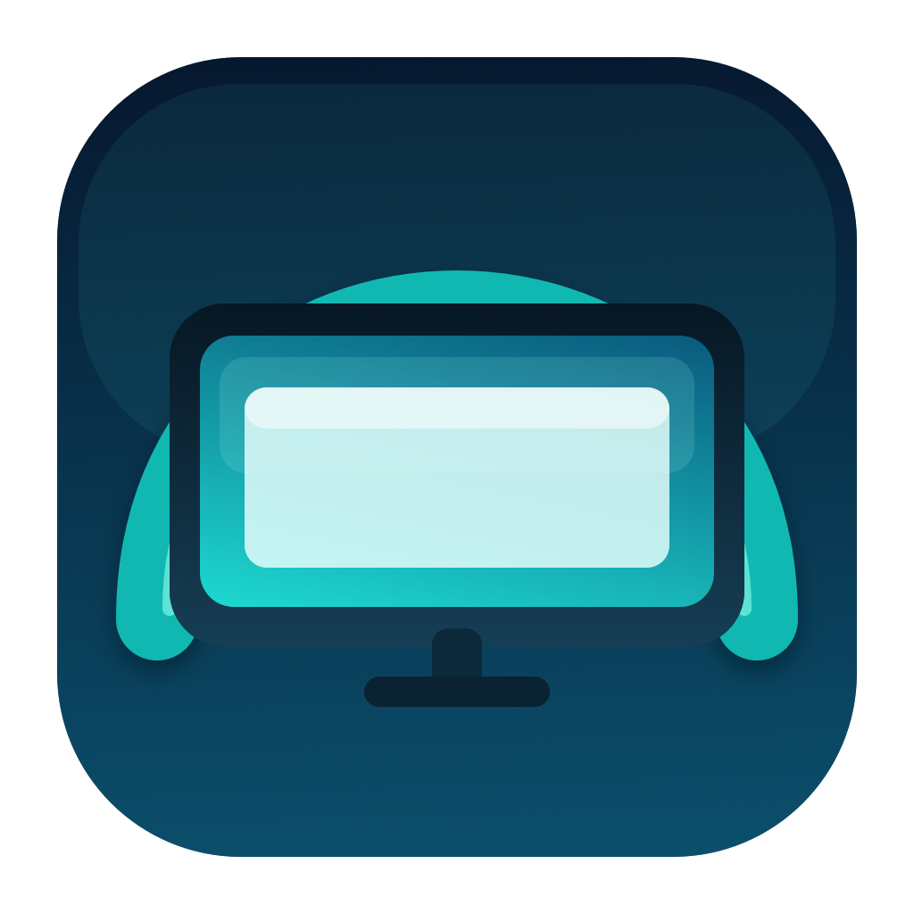
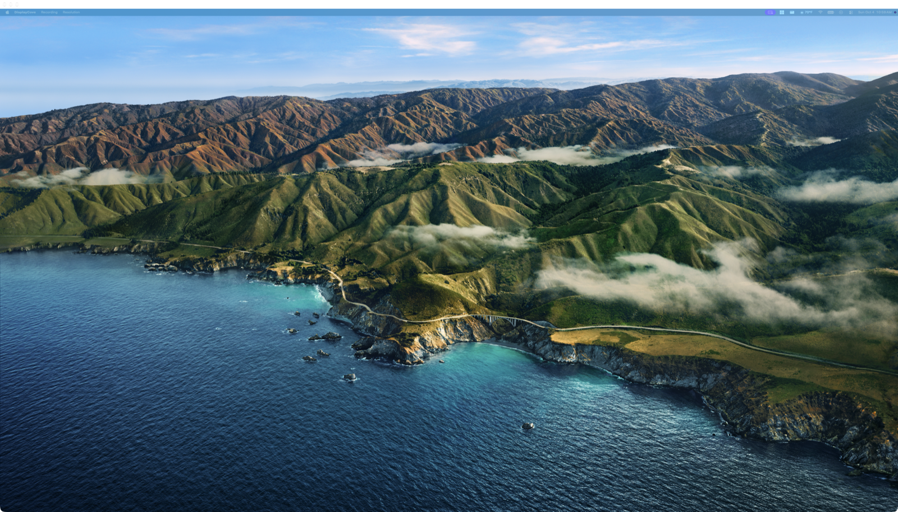
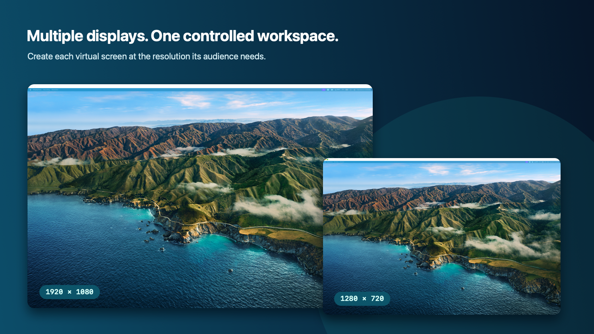
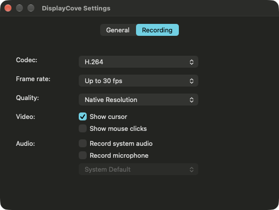

<p align="center">
  
</p>

<h1 align="center">DisplayCove</h1>

<p align="center"><strong>A dedicated desktop for every share.</strong></p>

<p align="center">
  <a href="https://github.com/MJuma/DisplayCove/actions/workflows/tests.yml">
    
  </a>
  <a href="LICENSE.md"></a>
  
  
</p>

DisplayCove creates a separate virtual screen so you can share a controlled portion of your workspace at a viewer-friendly resolution.

If you use an ultrawide or high-resolution display, sharing the entire physical screen can make text and controls uncomfortably small for everyone else.
DisplayCove gives Zoom, Teams, Meet, recording software, and similar apps a standard-sized virtual display that behaves like another monitor connected to your
Mac.

<p align="center">
  
</p>

## Features

- Create a HiDPI virtual display at a viewer-friendly resolution.
- Move any combination of windows onto a controlled desktop before sharing it.
- Choose common 16:9, 16:10, ultrawide, and compact resolutions from the menu.
- Create multiple independent virtual displays in one process.
- Record the active display to QuickTime using H.264 or HEVC.
- Optionally record system audio, microphone audio, the pointer, and mouse clicks.
- Preserve or restore physical-display HDR state after a virtual display is attached.
- Preview the virtual display locally using ScreenCaptureKit.
- Keep separate General and Recording preferences.

## Requirements

- macOS 27 or later.
- Screen & System Audio Recording permission for the live preview and recording.
- Microphone permission only when microphone recording is enabled.

## Installation

### GitHub Releases

The current GitHub binary is ad-hoc signed and not notarized. Download the [latest DisplayCove release](https://github.com/MJuma/DisplayCove/releases/latest) and
move DisplayCove to Applications.

Because the release is not notarized, macOS blocks its first launch:

1. Try to open DisplayCove once.
2. Open **System Settings → Privacy & Security**.
3. Choose **Open Anyway** for DisplayCove and confirm.
4. Grant **Screen & System Audio Recording** access when requested.

Only override Gatekeeper for an artifact downloaded from the official `MJuma/DisplayCove` release page.

### Build from source

```bash
git clone https://github.com/MJuma/DisplayCove.git
cd DisplayCove
xcodebuild \
  -project DisplayCove.xcodeproj \
  -scheme DisplayCove \
  -configuration Debug \
  CODE_SIGNING_ALLOWED=NO \
  build
```

See [DEVELOPMENT.md](DEVELOPMENT.md) for more development instructions.

## Getting started

1. Launch DisplayCove.
2. Follow the first-launch instructions to grant Screen & System Audio Recording access.
3. Choose the virtual display's resolution from the **Resolution** menu.
4. Move the windows you want to present onto the new display.
5. In your meeting or streaming application, share the display named **DisplayCove**.

DisplayCove creates the virtual screen; your meeting, streaming, or recording application performs the actual sharing or capture.

## Multiple displays

Choose **DisplayCove → New Screen** or press `Command+N` to create another independent virtual display. The first display is named **DisplayCove**; additional
displays are named **DisplayCove 2**, **DisplayCove 3**, and so on.

<p align="center">
  
</p>

## Recording

Use the **Recording** menu to record the active DisplayCove display. Recording options include:

- H.264 or HEVC video.
- Native, 1080p, or 720p output.
- Configurable frame rate.
- System and microphone audio.
- Pointer and mouse-click visibility.

Recordings are written only to the location selected in the save panel.

<p align="center">
  
</p>

## Permissions and privacy

DisplayCove does not include analytics, advertising, or usage telemetry. Screen and audio data are processed locally. See [PRIVACY.md](PRIVACY.md) for details
about permissions, saved preferences, recordings, and update checks.

## Troubleshooting

### Preview is blank or permission is repeatedly requested

1. Open **System Settings → Privacy & Security → Screen & System Audio Recording**.
2. Enable DisplayCove.
3. If it is already enabled, turn it off and on again.
4. Quit and reopen DisplayCove.

Development builds must use a stable signing identity for macOS to retain this permission between rebuilds.

### A virtual display remains after the app closes

Quit DisplayCove normally and allow it to finish cleanup. If macOS still shows a stale display, log out or restart the Mac before filing an issue with the
reproduction steps and OS build.

### Physical HDR changes when a display is created

Enable **Restore physical display HDR** in General settings. Restoration is best-effort because it depends on private CoreDisplay behavior.

## Contributing

See [CONTRIBUTING.md](CONTRIBUTING.md) for development expectations and [DEVELOPMENT.md](DEVELOPMENT.md) for the architecture and validation commands.

## License

DisplayCove is available under the [MIT License](LICENSE.md).

DisplayCove is based on the [DeskPad](https://github.com/Stengo/DeskPad) project.
